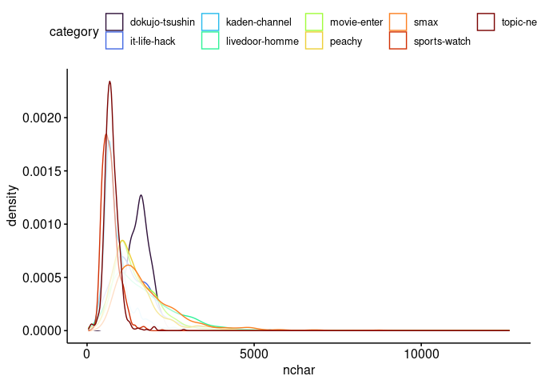
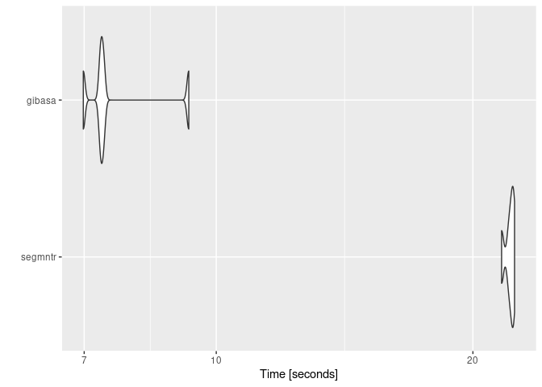

<!-- README.md is generated from README.Rmd. Please edit that file -->

# snowbill

> Supervised Learning Practices Using ‘tidymodels’

<!-- badges: start -->
<!-- badges: end -->

## Overview

[livedoorニュースコーパス](https://www.rondhuit.com/download.html#ldcc)を用いた文書分類について、日本語テキストの分かち書きに使うトークナイザを差し替えながら試しています。

## Summary of Dataset

コーパスのカテゴリごとの平均的な分量は次のようになっています。

``` r
suppressPackageStartupMessages({
  require(targets)
  require(tidymodels)
  require(textrecipes)
})
tidymodels::tidymodels_prefer(quiet = TRUE)

tar_read(nchar_summary)
#> # A tibble: 9 × 7
#>   category       nchar_mean nchar_median nchar_min nchar_max nchar_total     n
#>   <fct>               <dbl>        <dbl>     <dbl>     <dbl>       <dbl> <dbl>
#> 1 dokujo-tsushin       1529         1559       870      2122      117757    77
#> 2 it-life-hack         1493         1326       328      5773      120964    81
#> 3 kaden-channel         864          747       229      3931       77764    90
#> 4 livedoor-homme       1534         1121       393      5731       84393    55
#> 5 movie-enter          1383         1227       312      4118      116239    84
#> 6 peachy               1325         1223       392      2992      110057    83
#> 7 smax                 1741         1432       599      7042      151471    87
#> 8 sports-watch          674          641       292      1411       74206   110
#> 9 topic-news            722          706       132      1635       50606    70

tar_read(nchar_density)
```



## About Tokenizers

次のRパッケージによる分かち書きを試しています。

- [paithiov909/segmntr](https://github.com/paithiov909/segmntr)
- [paithiov909/gibasa](https://github.com/paithiov909/gibasa)
- [uribo/sudachir](https://github.com/uribo/sudachir)

ここでは文字列の正規化などはおこなわず、コーパスの本文を直接分かち書きしています。gibasaについては付与された品詞にもとづいて語彙をフィルタしています。

segmntrは、点予測にもとづく形態素解析器である[Vaporette](https://github.com/daac-tools/vaporetto)のラッパーです。VaporetteのバイナリはMeCabよりも高速ですが、segmntrでは関数を呼ぶたびにモデルファイルを読みこむ時間を要するため、ここではgibasa（MeCabをマルチスレッドで呼んでいる）のほうが解析速度が速くなっています。

``` r
source("R/rec.R")

dummy_data <-
  tibble::tibble(
    doc_id = seq_along(ldccr::NekoText),
    body = ldccr::NekoText,
    category = sample.int(9, length(ldccr::NekoText), replace = TRUE)
  ) |>
  dplyr::filter(nchar(body) > 50)

bench <-
  microbenchmark::microbenchmark(
    tokenizers = default_rec(dummy_data) |>
      recipes::prep() |>
      recipes::bake(new_data = NULL),
    gibasa = gibasa_rec(dummy_data) |>
      recipes::prep() |>
      recipes::bake(new_data = NULL),
    sudachir = sudachir_rec(dummy_data) |>
      recipes::prep() |>
      recipes::bake(new_data = NULL),
    segmntr = segmntr_rec(dummy_data) |>
      recipes::prep() |>
      recipes::bake(new_data = NULL),
    times = 5,
    check = NULL
  )
#> as(<dgTMatrix>, "dgCMatrix") is deprecated since Matrix 1.5-0; do as(., "CsparseMatrix") instead

bench
#> Unit: seconds
#>        expr       min        lq      mean    median        uq       max neval
#>  tokenizers  1.810579  1.821057  2.070419  1.830976  1.864882  3.024602     5
#>      gibasa  6.515490  6.835027  7.073956  7.004209  7.045967  7.969086     5
#>    sudachir 10.177166 10.204096 10.742806 10.298198 10.311038 12.723531     5
#>     segmntr 20.304546 20.396370 20.528224 20.398717 20.718487 20.823000     5
#>   cld
#>  a   
#>   b  
#>    c 
#>     d

ggplot2::autoplot(bench)
#> Coordinate system already present. Adding new coordinate system, which will
#> replace the existing one.
```



### Modeling

tidymodelsを用いてXGBoostのモデルを学習しています。わずかな差ですが、segmntrを用いたときが精度のよいモデルを学習できています。

``` r
tar_read(best_models)
#> # A tibble: 5 × 9
#>   wflow_id               .config .metric  mean std_err     n prepr…¹ model  rank
#>   <chr>                  <chr>   <chr>   <dbl>   <dbl> <int> <chr>   <chr> <int>
#> 1 segmntr_boost_tree     Prepro… f_meas  0.812 0.0305      3 recipe  boos…     1
#> 2 gibasa_boost_tree      Prepro… f_meas  0.808 0.0191      3 recipe  boos…     2
#> 3 sudachir_boost_tree    Prepro… f_meas  0.792 0.0111      3 recipe  boos…     3
#> 4 gibasa_with_filter_bo… Prepro… f_meas  0.784 0.00557     3 recipe  boos…     4
#> 5 default_boost_tree     Prepro… f_meas  0.758 0.0213      3 recipe  boos…     5
#> # … with abbreviated variable name ¹​preprocessor
```

ここで最終的に作成されるモデルは次のようになります。

``` r
(wflow <- tar_read(corp_wflow))
#> ══ Workflow ════════════════════════════════════════════════════════════════════
#> Preprocessor: Recipe
#> Model: boost_tree()
#> 
#> ── Preprocessor ────────────────────────────────────────────────────────────────
#> 3 Recipe Steps
#> 
#> • step_tokenize()
#> • step_tokenfilter()
#> • step_texthash()
#> 
#> ── Model ───────────────────────────────────────────────────────────────────────
#> Boosted Tree Model Specification (classification)
#> 
#> Main Arguments:
#>   trees = 300
#>   tree_depth = 1
#>   learn_rate = 0.2
#>   loss_reduction = 0.00626153110866815
#>   sample_size = 0.837367888679728
#>   stop_iter = 5
#> 
#> Engine-Specific Arguments:
#>   nthread = max(1, parallel::detectCores(logical = FALSE) - 1, na.rm = 1)
#> 
#> Computational engine: xgboost

(corpus <- tar_read(corp_split))
#> <Training/Testing/Total>
#> <549/188/737>

ret <- tune::last_fit(wflow, corpus)
```

``` r
ret |>
  tune::collect_predictions() |>
  yardstick::f_meas(truth = category, estimate = .pred_class)
#> # A tibble: 1 × 3
#>   .metric .estimator .estimate
#>   <chr>   <chr>          <dbl>
#> 1 f_meas  macro          0.819
```
