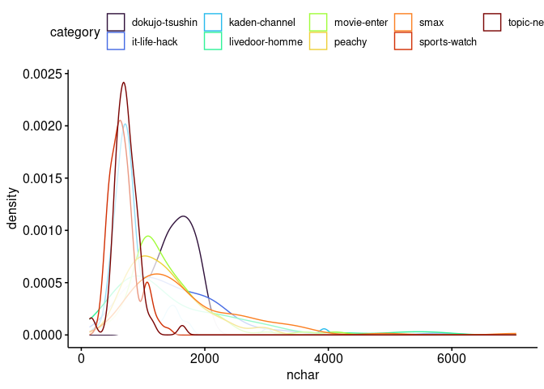
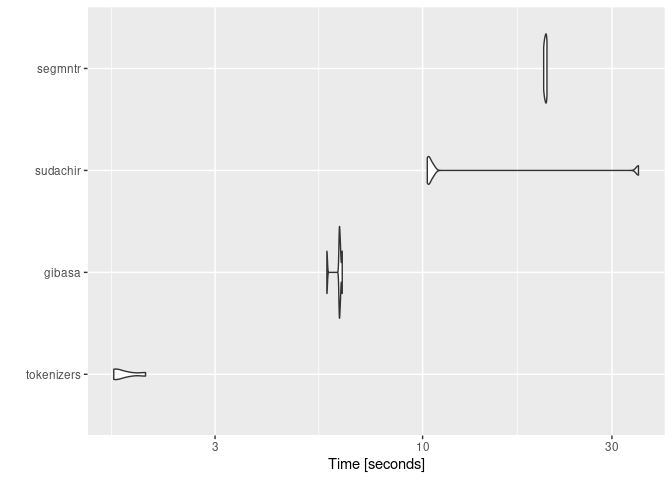

<!-- README.md is generated from README.Rmd. Please edit that file -->

# snowbill

> Suprevised Learning Practices Using ‘tidymodels’

<!-- badges: start -->
<!-- badges: end -->

## Overview

[Livedoorニュースコーパス](https://www.rondhuit.com/download.html#ldcc)を用いた文書分類について、日本語テキストの分かち書きに使うトークナイザを差し替えながら試しています。

## Summary of Dataset

コーパスのカテゴリごとの平均的な分量は次のようになっています。

``` r
suppressPackageStartupMessages({
  require(targets)
  require(tidymodels)
  require(textrecipes)
})
tidymodels::tidymodels_prefer(quiet = TRUE)

tar_read(nchar_summary)
#> # A tibble: 9 × 7
#>   category       nchar_mean nchar_median nchar_min nchar_max nchar_total     n
#>   <fct>               <dbl>        <dbl>     <dbl>     <dbl>       <dbl> <dbl>
#> 1 dokujo-tsushin       1559         1575        56      4619     1358728   871
#> 2 it-life-hack         1449         1249       139     12642     1262648   871
#> 3 kaden-channel         893          757       142      5472      772623   865
#> 4 livedoor-homme       1674         1460        37      5731      857520   512
#> 5 movie-enter          1456         1297        59      6002     1268470   871
#> 6 peachy               1402         1242        74      5888     1182028   843
#> 7 smax                 1847         1550       138      8794     1609529   871
#> 8 sports-watch          697          656       143      2247      628762   901
#> 9 topic-news            738          713       106      2893      569065   771

tar_read(nchar_density)
```



## About Tokenizers

次のRパッケージによる分かち書きを試しています。

- [paithiov909/segmntr](https://github.com/paithiov909/segmntr)
- [paithiov909/gibasa](https://github.com/paithiov909/gibasa)

ここでは文字列の正規化などはおこなわず、コーパスの本文を直接分かち書きしています。gibasaについては付与された品詞にもとづいて語彙をフィルタしています。

segmntrは、点予測にもとづく形態素解析器である[Vaporette](https://github.com/daac-tools/vaporetto)のラッパーです。VaporetteのバイナリはMeCabよりも高速ですが、segmntrでは関数を呼ぶたびにモデルファイルを読みこむ時間を要するため、ここではgibasa（MeCabをマルチスレッドで呼んでいる）のほうが解析速度が速くなっています。

``` r
source("R/rec.R")

dummy_data <-
  tibble::tibble(
    doc_id = seq_along(ldccr::NekoText),
    body = ldccr::NekoText,
    category = sample.int(9, length(ldccr::NekoText), replace = TRUE)
  )


bench <-
  microbenchmark::microbenchmark(
    segmntr = segmntr_rec(dummy_data) |>
      recipes::prep() |>
      recipes::bake(new_data = NULL),
    gibasa = gibasa_rec(dummy_data) |>
      recipes::prep() |>
      recipes::bake(new_data = NULL),
    times = 5,
    check = NULL
  )
#> as(<dgTMatrix>, "dgCMatrix") is deprecated since Matrix 1.5-0; do as(., "CsparseMatrix") instead

bench
#> Unit: seconds
#>     expr       min        lq     mean    median        uq       max neval cld
#>  segmntr 21.611169 22.038543 22.10487 22.211635 22.282710 22.380300     5   b
#>   gibasa  6.983043  7.308906  7.65979  7.340097  7.381957  9.284947     5  a

ggplot2::autoplot(bench)
#> Coordinate system already present. Adding new coordinate system, which will
#> replace the existing one.
```



### Modeling

tidymodelsを用いてXGBoostのモデルを学習しています。わずかな差ですが、segmntrを用いたほうが精度のよいモデルを学習できています。

``` r
tar_read(best_models)
#> # A tibble: 2 × 9
#>   wflow_id           .config     .metric  mean std_err     n prepr…¹ model  rank
#>   <chr>              <chr>       <chr>   <dbl>   <dbl> <int> <chr>   <chr> <int>
#> 1 segmntr_boost_tree Preprocess… f_meas  0.912 0.00124     3 recipe  boos…     1
#> 2 gibasa_boost_tree  Preprocess… f_meas  0.906 0.00302     3 recipe  boos…     2
#> # … with abbreviated variable name ¹​preprocessor
```

ここで最終的に作成されるモデルは次のようになります。

``` r
(wflow <- tar_read(corp_wflow))
#> ══ Workflow ════════════════════════════════════════════════════════════════════
#> Preprocessor: Recipe
#> Model: boost_tree()
#> 
#> ── Preprocessor ────────────────────────────────────────────────────────────────
#> 3 Recipe Steps
#> 
#> • step_tokenize()
#> • step_tokenfilter()
#> • step_texthash()
#> 
#> ── Model ───────────────────────────────────────────────────────────────────────
#> Boosted Tree Model Specification (classification)
#> 
#> Main Arguments:
#>   trees = 500
#>   tree_depth = 11
#>   learn_rate = 0.2
#>   loss_reduction = 7.86115706306508e-08
#>   sample_size = 0.69542784715537
#>   stop_iter = 5
#> 
#> Computational engine: xgboost

(corpus <- tar_read(corp_split))
#> <Training/Testing/Total>
#> <5528/1848/7376>

ret <- tune::last_fit(wflow, corpus)
```

``` r
ret |>
  tune::collect_predictions() |>
  yardstick::f_meas(truth = category, estimate = .pred_class)
#> # A tibble: 1 × 3
#>   .metric .estimator .estimate
#>   <chr>   <chr>          <dbl>
#> 1 f_meas  macro          0.927
```
